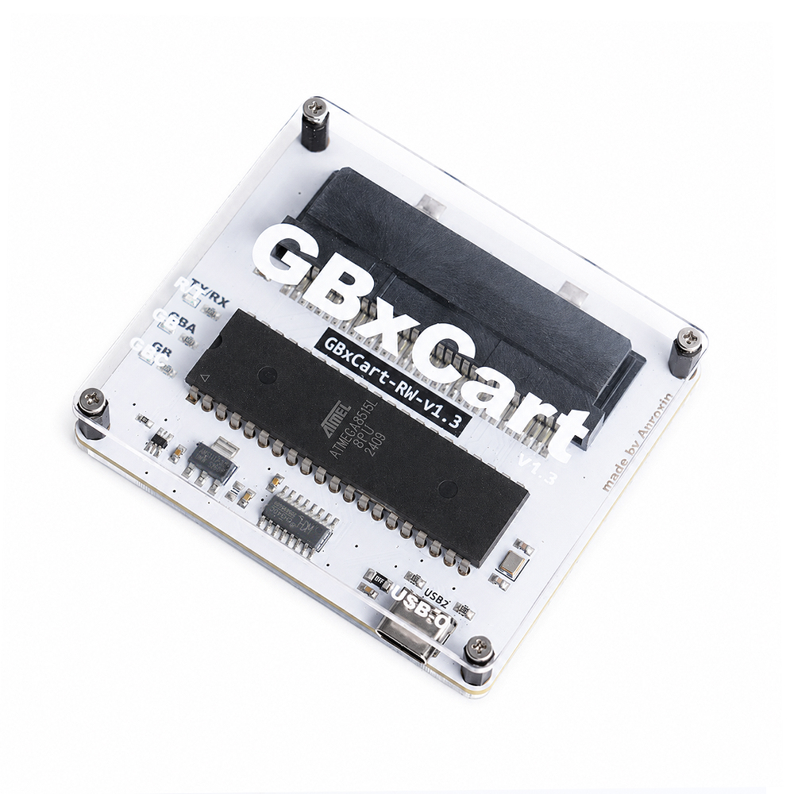

# GBxCart RW v1.3 PCB Re-Layout

This project is a PCB re-layout based on the [insideGadgets GBxCart RW](https://www.gbxcart.com/) v1.3 hardware design, with improved component placement and PCB routing.

GBxCart RW can be used to read Game Boy, Game Boy Color, and Game Boy Advance cartridges, as well as to back up and restore cartridge save data. For software, firmware, usage instructions, and compatibility information, please visit the [official GBxCart RW website](https://www.gbxcart.com/) and the [official product page](https://shop.insidegadgets.com/product/gbxcart-rw/).

  

## Features of This Version

- Re-designed PCB layout based on the GBxCart RW v1.3 hardware
- Optimized component placement and PCB routing
- ENIG (Electroless Nickel Immersion Gold) surface finish
- Acrylic protective enclosure
- KiCad PCB project files and production-ready Gerber files included

## Repository Contents

- `PCB/` — KiCad project and PCB source files
- `Gerber/` — PCB manufacturing files
- `extras/` — Additional related files

## Purchase and Support

Assembled boards of this version are available for purchase on AliExpress. If you like this PCB re-layout and would like to support further development and maintenance, please consider purchasing one from my AliExpress store.

**[Purchase the assembled GBxCart RW v1.3 PCB on AliExpress](https://www.aliexpress.com/item/1005012667748987.html)**

## Acknowledgements

Special thanks to [insideGadgets](https://www.insidegadgets.com/) for creating and maintaining the GBxCart RW project. I would also like to thank every open-source developer and community member who has contributed to its hardware, firmware, software, documentation, and compatibility testing.

This PCB re-layout would not have been possible without their work and willingness to share it with the community. Please visit and support the [original GBxCart RW project](https://www.gbxcart.com/) and its creators.

## Disclaimer

This is an unofficial PCB re-layout based on the GBxCart RW v1.3 hardware. It is not affiliated with, endorsed by, or officially authorized by insideGadgets. The GBxCart RW name and original design belong to their respective owners.

Please use this device only to back up or manage cartridges and data that you legally own, and comply with all applicable laws in your jurisdiction. Use of the files in this repository is at your own risk.
